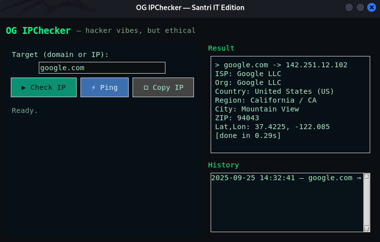

# IP Checker GUI

[](LICENSE)  
[]  

## Deskripsi
**IP Checker GUI** adalah aplikasi desktop sederhana berbasis **Tkinter** untuk mengecek alamat IP dari domain atau hostname tertentu.  
Aplikasi ini memanfaatkan API publik untuk mengambil informasi IP, lalu menampilkannya langsung di jendela GUI dengan tampilan sederhana dan user friendly.  

Cocok digunakan untuk:
- Belajar membuat GUI Python dengan Tkinter.  
- Mengecek alamat IP dari domain.  
- Latihan integrasi API sederhana ke aplikasi desktop.  

## Fitur
- Input domain/hostname melalui GUI.  
- Mendapatkan alamat IP target secara real-time.  
- Menampilkan hasil di dalam aplikasi (tidak perlu terminal).  
- Tombol **Clear** untuk membersihkan hasil pencarian.  
- Ringan dan cross-platform (Linux, Windows, macOS).  

## Prasyarat
- Python 3.10 atau lebih baru  
- Sistem operasi: Linux / macOS / Windows  

## Instalasi
```bash
git clone https://github.com/YogaRmdn/Ip-Checker-GUI
cd Ip-Checker-GUI
python check.py
```

