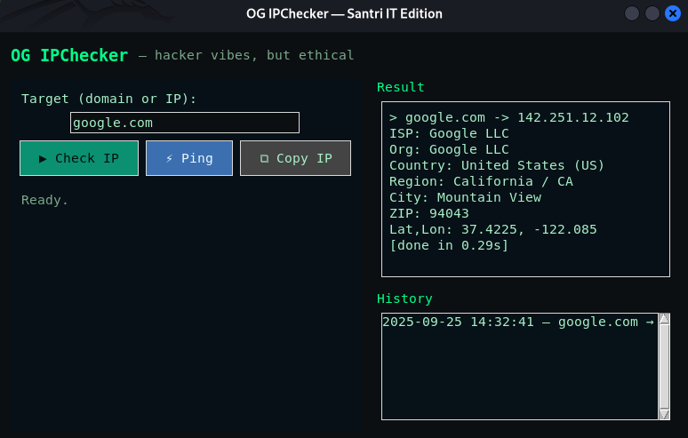

# IP Checker GUI

[](LICENSE)  
[]  

## Description
**IP Checker GUI** is a simple Tkinter-based desktop application for checking the IP address of a specific domain or hostname.
This application utilizes a public API to retrieve IP information and then displays it directly in a simple and user-friendly GUI window.

Suitable for:
- Learning to create Python GUIs with Tkinter.
- Checking the IP address of a domain.
- Practicing simple API integration into desktop applications.

## Features
- Input domain/hostname via GUI.
- Get the target IP address in real-time.
- Display results within the application (no terminal required).
- Clear button to clear search results.
- Lightweight and cross-platform (Linux, Windows, macOS).

## Prerequisites
- Python 3.10 or later
- Operating system: Linux / macOS / Windows 

## How to use Tools
```bash
git clone https://github.com/YogaRmdn/Ip-Checker-GUI
cd Ip-Checker-GUI
python check.py
```

